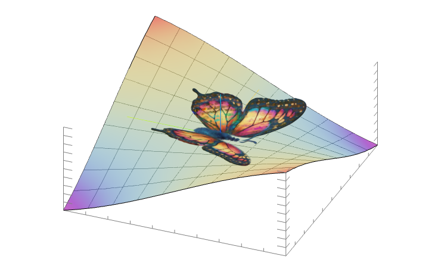

# SplatMesh 🫟

SplatMesh is a small Wolfram Language paclet for importing, manipulating, and exporting Gaussian splatting meshes (.spz files). It provides a compact in-memory representation of splats (centers, scales, orientations, color and opacity data) using [SPZ format](https://github.com/nianticlabs/spz), extends default `Import`, `Export` expressions, allows bulk operations, simple transformations, and a lightweight preview using Wolfram Standard Library.


## Supported Environments
- [x] [Mathematica](https://www.wolfram.com/mathematica/)
- [x] [WolframScript](https://www.wolfram.com/engine/) *Freeware!*
- [x] [WLJS Notebook](https://wljs.io/) *Freeware!*

## A note for WLJS Notebook
This paclet is intentionally tiny and designed to integrate with open-source [Spark.js](https://sparkjs.dev/) ✨ library for GPU-based rendering in browser contexts. Since WLJS Notebook is a web-based app, **you can fully render and integrate Gaussian splats with your Graphics3D primitives**



```mathematica
Plot3D[x y, {x,-1,1}, {y,-1,1}, Epilog->{SplatMesh[<...>]}]
```

See [**online demo**]() 🧙🏼‍♂️

## Contents

- `Kernel/SplatMesh.wl` — Core Wolfram Language definitions and API.
- `Kernel/Parser.wl` — SPZ import/export helpers and parser utilities.
- `Examples/` — Example `.spz` files (`butterfly.spz`, `hornedlizard.spz`).

*Relevant only for WLJS Notebook users:*
These assets are loaded automatically to the runtime once paclet has required:

- `Assets/Spark/` — Spark.js runtime helpers for rendering.
- `Assets/Bundle/bundle.js` — Bundled JavaScript for embedding notebooks with splats (it will be used automatically upon export).

## Supported Formats
- [x] `.spz`
- [ ] `.ply`

## Key concepts

- `SplatMesh`: An immutable symbolic representation of a Gaussian splatting mesh. Internally it stores either a packed (gzip-compressed binary) or unpacked (`Association`-based) representation.


## Installation

### Manual
Copy the paclet folder into one of the paclet directories or add the project to your Wolfram Language search path. The paclet metadata is in `PacletInfo.wl`.

```bash

```

```mathematica

```

### Using LPM
Drop this snippet and evaluate it:

```mathematica

```

## Quick examples

Import a file and preview it:

		mesh = Import["path/to/model.spz", "SPZ"]

Show properties available for an object:

		mesh["Properties"]

Get raw data or a specific property (centers, RGB, Opacities, Scales, Quaternions):

		centers = mesh["Centers"]
		rgb = mesh["RGB"]

Convert between packed and unpacked representations:

		unpacked = SplatMeshUnpack[mesh]
		packed = SplatMeshPack[unpacked]

*Note: unpacking/packing occurs automatically when you apply any transformations on packed (default) splats. Unpack manually if you want to apply many transformations in series*

Apply a matrix transform to all centers (unpacked or packed is handled):

		mesh2 = TransformedSplat[mesh, matrix3]

Apply a matrix + translation:

		mesh3 = TransformedSplat[mesh, {matrix3, translationVector}]

Apply a custom per-splat function:

		f[idx_, center_, scale_, quat_, opacity_, rgb_] := {center + {0.0,0.0,1.0}, scale*1.1, quat, opacity*0.95, rgb};
		mesh4 = TransformedSplat[mesh, f]

Append new splats (unpacked or packed supported):

		new = {{x,y,z},{sx,sy,sz},{qx,qy,qz,qw},opacity,{r,g,b}}
		mesh5 = Append[mesh, new]

Or append multiple splats at once by passing a **list of splats**.

Export back to .spz:

		Export["out.spz", mesh, "SPZ"]

## API Reference

All API functions below are defined in `Kernel/SplatMesh.wl`. You can see them by evaluating:

```mathematica
Names["CoffeeLiqueur`Workshop`SplatMesh`*"]
```

- `SplatMesh`::usage
	- Represents a SplatMesh object. Constructed by importers or returned by functions in this paclet.

- `SplatMeshPack[s_SplatMesh]`
	- Input: SplatMesh in unpacked form.
	- Output: Packed SplatMesh containing gzip-compressed binary data suitable for export.
	- Errors: Returns $Failed for invalid input.

- `SplatMeshUnpack[s_SplatMesh]`
	- Input: SplatMesh in packed form.
	- Output: Unpacked SplatMesh with an Association of arrays: "Centers", "Scales", "Quaternions", "Opacities", "RGB", plus SH1/SH2/SH3 (spherical harmonics) where present.

- `SplatMeshPackedQ[s_SplatMesh]`
	- Returns True when the mesh is in packed form, False otherwise.

- `TransformedSplat[s_SplatMesh, transform]`
	- transform can be:
		- a 3x3 numeric matrix — multiplies centers by matrix
		- {matrix, vector} — applies matrix then translates by vector
		- a function with signature (index, center, scale, quaternion, opacity, rgb) returning {center, scale, quaternion, opacity, rgb}
	- Works for packed meshes by unpacking and repacking automatically.
	- Returns $Failed and emits TransformedSplat::badfunction if the supplied function doesn't return the expected shape.

- `Append[s_SplatMesh, data]`
	- Overloaded `Append` handler on the SplatMesh head.
	- `Append[s, splat]` accepts a single splat or a list of splats in the shape: {center, scale, quaternion, opacity, rgb} where
		- center: {x,y,z}
		- scale: {sx,sy,sz}
		- quaternion: {qx,qy,qz,qw}
		- opacity: numeric
		- rgb: {r,g,b}
	- Returns a new SplatMesh with the splats appended. For packed meshes the operation will unpack and repack automatically.
	- If input is malformed, Append will return $Failed and emit `appendSplats::badsplats`.

- `SplatMesh[...][property_String]`
	- Use the bracket syntax to query properties:
		- SplatMesh[...]["Centers"] — Nx3 array of centers
		- SplatMesh[...]["Scales"] — Nx3 array of scales
		- SplatMesh[...]["Quaternions"] — Nx4 array of quaternions
		- SplatMesh[...]["Opacities"] — length-N list of opacities
		- SplatMesh[...]["RGB"] — Nx3 array of RGB values
		- SplatMesh[...]["RawData"] — the underlying ByteArray (for packed meshes) or raw association
		- SplatMesh[...]["Format"] — "Packed" or "Unpacked"
		- SplatMesh[...]["Container"] — always "SPZ"
		- SplatMesh[...]["Size"] — Quantity representing the raw byte size when available
		- SplatMesh[...]["Properties"] — list of available property keys

## Examples

Load an example and preview it in a notebook:

        pacletDir = ;
		mesh = Import[FileNameJoin[{pacletDir, "Examples","butterfly.spz"}], "SPZ"]
		mesh

another example:

        mesh = Import[FileNameJoin[{pacletDir, "Examples","hornedlizard.spz"}], "SPZ"]

Transform and export:

		rotated = TransformedSplat[mesh, RotationMatrix[Pi/2, {0,0,1}] // N]
		Export["butterfly_rotated.spz", rotated, "SPZ"]

Append splats programmatically:

		newSplat = {{0,0,0},{0.01,0.01,0.01},{0,0,0,1},1.,{1,0,0}} // N;
		mesh2 = Append[mesh, newSplat]


## License and credits
- 3D model `hornedlizard.spz`: [Niantic Labs](https://github.com/nianticlabs), MIT
- 3D model `butterfly.spz`: [Spark.js](https://sparkjs.dev/), MIT
- 3D rendering Javascript library `spark.js`: [Spark.js](https://sparkjs.dev/), MIT

The rest of source code is licensed under MIT — see `PacletInfo.wl` for metadata.